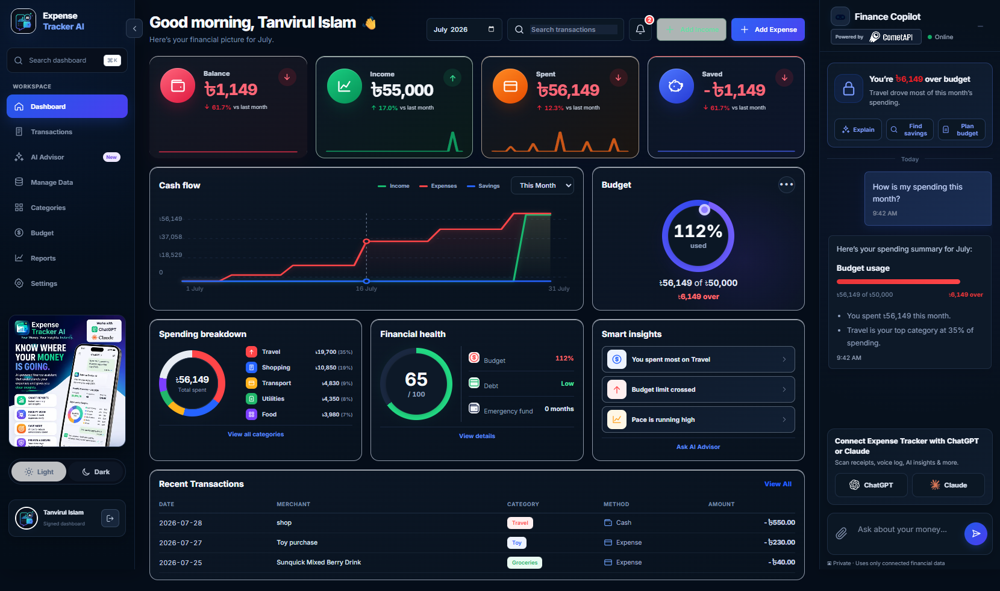
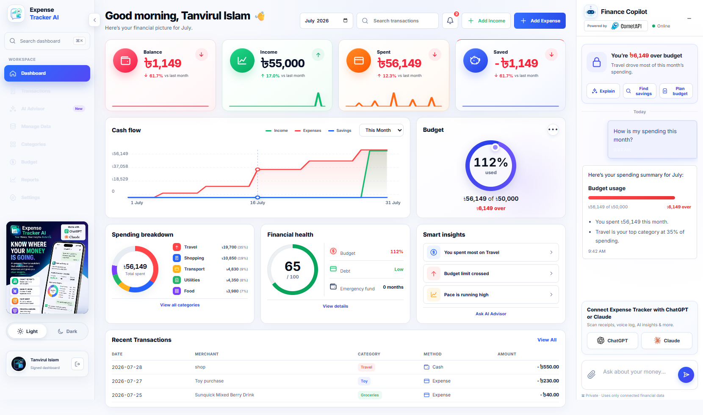
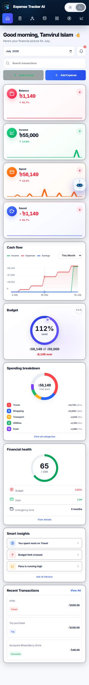
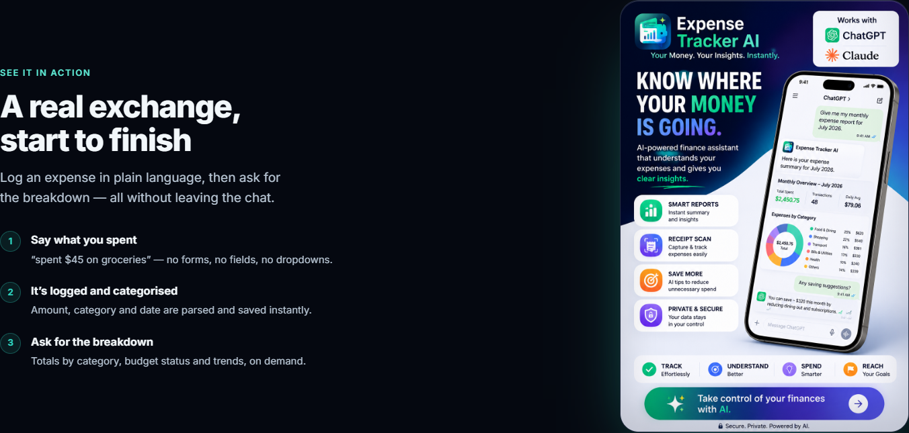

# Money Copilot AI Web Dashboard

Money Copilot AI is a full-stack, Vercel-hosted personal finance dashboard featuring protected serverless functions, responsive light/dark themes, Model Context Protocol (MCP) tool integration, and an interactive Money Copilot AI assistant. It uses Turso/libSQL for persistent expense tracking and signed, HTTP-only cookies for session security—ensuring user IDs and raw API keys are never exposed to the client-side browser or LLM prompts.

---

## 🎨 UI & Interface Showcase

### Desktop Dashboard (Dark & Light Themes)

| Dark Theme | Light Theme |
| :--- | :--- |
|  |  |

### Mobile Dashboard & Landing Experience

| Mobile Dashboard | Landing Page Showcase |
| :--- | :--- |
|  |  |

---

## 🚀 Key Features & Experience

- **Responsive Mobile-First Dashboard**: Light and dark theme modes with dynamic greetings, spending cards, financial reports, budget progress, recent transactions, and smart insights.
- **Sticky Blur Header & Theme Toggle**: Glassmorphism sticky top navigation bar with backdrop blur and an integrated mobile header theme toggle button.
- **Interactive Money Copilot AI**: Conversational assistant capable of querying, adding, updating, and exporting financial data through authenticated MCPize tools.
- **Email Spending Reports**: Pre-formatted mail draft flow containing selected monthly spending, income, cash-flow, and budget metrics.
- **Touch & Mobile Optimizations**: WCAG-compliant 44px touch targets, momentum touch-scrolling for transaction tables, and safe-area inset protection (`env(safe-area-inset-bottom)`) for fixed mobile controls.
- **Owner Monitoring Console**: Administrative console at `/owner/monitor` for auditing aggregate activity metrics without exposing user transaction descriptions or financial amounts.

---

## 🔒 Security Architecture

- **OAuth 2.0 PKCE Authentication**: Authorization flow against MCPize uses PKCE (`code_challenge` S256 + `code_verifier`), preventing authorization code interception attacks.
- **Signed HTTP-Only Sessions**: Dashboard sessions are stored inside `HttpOnly; Secure; SameSite=Lax` cookies signed with HMAC-SHA256 (`DASHBOARD_SESSION_SECRET`) and verified using `crypto.timingSafeEqual`.
- **Database & Data Boundary**: All database queries strictly use parameterized SQL (`WHERE user_id = ?`) to enforce multi-tenant data isolation and prevent SQL injection.
- **Server-Side MCP Tool Execution**: MCP access tokens and LLM API keys remain strictly on the serverless backend (`/api/ai-chat`), never exposed to browser scripts.

---

## ⚙️ Environment Variables

Configure these environment variables in Vercel or `.env.local`:

```text
# LLM & Model Routing (CometAPI OpenAI-compatible endpoint)
COMET_API_KEY=your-secret-key
FAST_MODEL=gemini-2.5-flash-lite
DEFAULT_MODEL=gemini-2.5-flash
ADVANCED_MODEL=deepseek-v3.2
PREMIUM_MODEL=kimi-k2.5

# Database & Dashboard Session Secrets
TURSO_DATABASE_URL=libsql://your-database.turso.io
TURSO_AUTH_TOKEN=your-turso-auth-token
DASHBOARD_SESSION_SECRET=a-long-random-secret-shared-with-the-dashboard-session

# Owner Console (Optional / Production Monitoring)
OWNER_EMAIL=owner@example.com
OWNER_PASSWORD_HASH=scrypt$base64url-salt$base64url-hash
OWNER_SESSION_SECRET=a-different-random-secret-of-at-least-32-characters
```

To generate a compatible scrypt password hash for the owner console:

```powershell
node -e "const {randomBytes,scryptSync}=require('crypto');const p=process.argv[1],s=randomBytes(16);console.log('scrypt$'+s.toString('base64url')+'$'+scryptSync(p,s,64).toString('base64url'))" "your-password"
```

---

## 🤖 AI Endpoint (`POST /api/ai-chat`)

```json
{ 
  "message": "How much did I spend on dining out this month?", 
  "month": "2026-07" 
}
```

The endpoint extracts the signed `expense_tracker_dashboard` cookie, discovers the user's live MCPize tool catalog (`tools/list`), and executes tools (`tools/call`) such as `add_expense`, `update_expense`, `set_budget`, `full_budget_report`, and `export_expenses`.

Request routing automatically picks the optimal model tier (Flash-Lite for quick lookups, Flash for reports, Advanced for trend comparisons, Premium for complex financial planning) with automatic fallback handling, rate limiting (18 req/min), and prompt sanitization.

---

## 📁 Project Structure

```text
.
├── api/                       # Vercel Serverless Function entrypoints
├── site/
│   ├── index.html             # Landing Page & Sticky Header Nav
│   ├── api/                   # Serverless Backend Handlers (AI Chat, Auth, Dashboard, Owner)
│   ├── dashboard/             # Customer Dashboard Frontend (app.js, styles.css, report.css)
│   └── owner/                 # Administrative Monitoring Console
├── work/                      # UI showcase & screenshot media assets
├── vercel.json                # Vercel routing rules & rewrites
└── README.md                  # Project documentation & UI showcase
```
